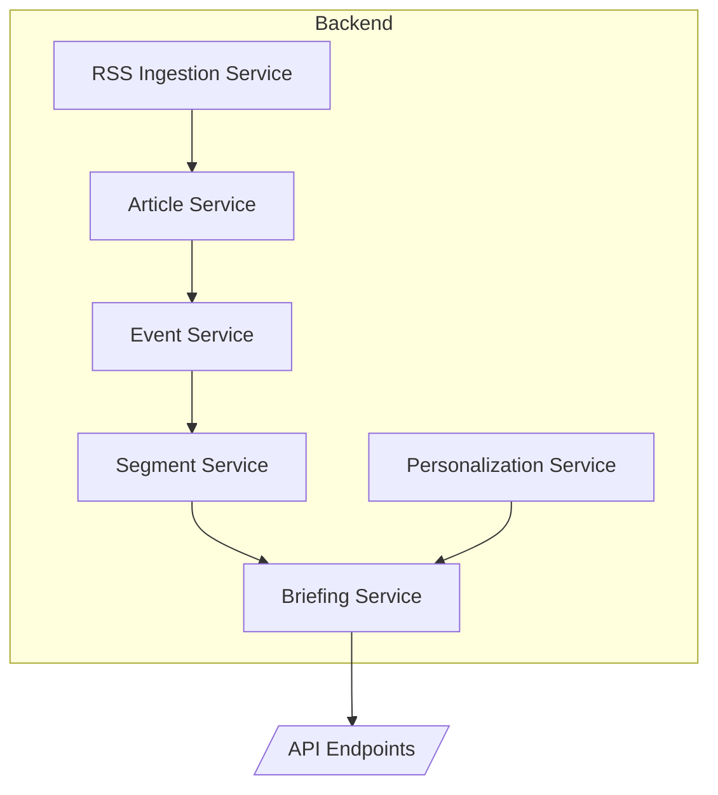
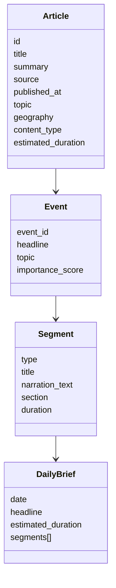
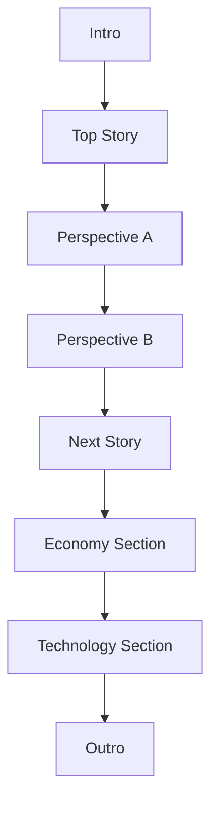
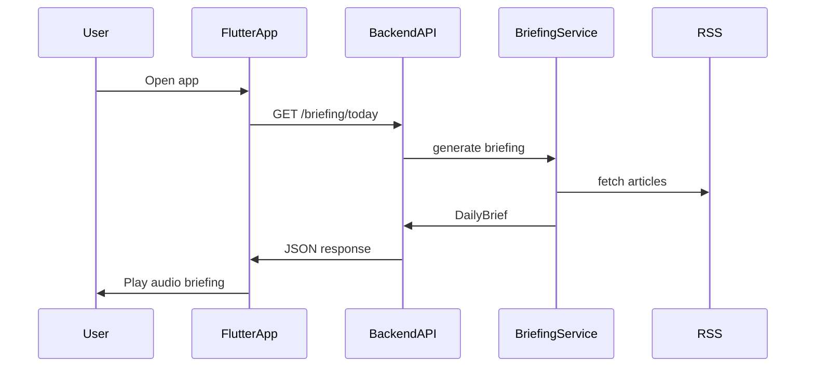

# OpenWave / Angle – System Architecture

This document describes the current technical architecture of the OpenWave system.

For conceptual architecture see:

docs/PROJECT_MAP_v2.md

---

# OpenWave – Arhitectura Backend (Next Architecture pentru MVP)

**Versiune:** 1.0
**Data:** Martie 2026
**Scop:** Definirea unei arhitecturi backend simple, clare și extensibile pentru MVP-ul OpenWave.

---

# 1. Filosofia Arhitecturii

OpenWave nu trebuie construit inițial ca o platformă AI complexă.
Pentru MVP este mult mai sănătos să existe un **pipeline clar de procesare a conținutului**, în care fiecare serviciu face un singur lucru.

Principiul de bază:

```
Surse → Articole → Evenimente → Segmente → Briefing → Redare Audio
```

Acest pipeline transformă fluxul haotic de articole de pe internet într-un **briefing audio structurat**.

Arhitectura trebuie să fie:

* modulară
* ușor de înțeles
* ușor de extins
* ușor de depanat

Pentru MVP, tot backend-ul poate rula într-un **singur serviciu FastAPI**.

---

# 2. Modelele principale de date

Pentru MVP sunt suficiente **patru modele principale**.

---

## Article

Reprezintă unitatea de bază de informație colectată din RSS.

Exemplu structură:

```
Article
│
├─ id
├─ title
├─ summary
├─ url
├─ source
├─ published_at
├─ language
├─ topic
├─ geography
├─ content_type
├─ estimated_duration
└─ section
```

Rol:

* normalizează conținutul provenit din surse diferite
* permite adăugarea de metadata

---

## Event

Un **eveniment** grupează mai multe articole despre aceeași știre.

Exemplu:

```
Event
│
├─ event_id
├─ headline
├─ topic
├─ geography
├─ importance_score
└─ articles[]
```

Avantaj:

Evită situații de genul:

```
Reuters: EU defense plan approved
BBC: Europe increases defense spending
DW: EU leaders agree new defense budget
```

Toate aceste articole devin **un singur eveniment**.

---

## Segment

Segmentul este **unitatea audio reală** din briefing.

Tipuri de segmente:

```
intro
section_cue
article
perspective
transition
outro
```

Exemplu:

```
Segment
│
├─ type: article
├─ title
├─ narration_text
├─ source_label
├─ section
└─ duration_estimate
```

Playerul consumă **segmente**, nu articole.

---

## DailyBrief

Reprezintă briefingul final trimis aplicației.

Structură:

```
DailyBrief
│
├─ date
├─ headline
├─ estimated_duration
├─ segments[]
└─ articles[]
```

DailyBrief este practic **playlist-ul audio al zilei**.

---

# 3. Serviciile backend

Arhitectura backend poate fi organizată în **6 servicii logice**.

---

## 3.1 RSS Ingestion Service

Responsabilități:

* citește feedurile RSS
* extrage articole
* normalizează datele

Diagramă:

```
RSS Feeds
   │
   ▼
RSS Ingestion Service
   │
   ▼
ArticleRaw
```

Output:

```
ArticleRaw
```

---

## 3.2 Article Processing Service

Transformă articolele brute în articole procesate.

Responsabilități:

* elimină duplicate evidente
* adaugă metadata
* estimează durata audio

Diagramă:

```
ArticleRaw
   │
   ▼
Article Processing
   │
   ▼
Article
```

Exemple de metadata:

```
topic
geography
content_type
section
estimated_duration
```

---

## 3.3 Event Clustering Service

Grupează articolele care vorbesc despre același eveniment.

Diagramă:

```
Article
   │
   ▼
Event Clustering
   │
   ▼
Event
```

Problema rezolvată:

Evită repetarea aceleiași știri în briefing.

---

## 3.4 Segment Service

Transformă articolele sau evenimentele în segmente audio.

Diagramă:

```
Event / Article
     │
     ▼
Segment Service
     │
     ▼
Segments
```

Exemple de segmente:

```
IntroSegment
ArticleSegment
PerspectiveSegment
TransitionSegment
OutroSegment
```

---

## 3.5 Briefing Service

Este **orchestratorul principal** al aplicației.

Responsabilități:

* selectează evenimentele importante
* stabilește ordinea
* creează structura briefingului
* generează playlistul final

Diagramă:

```
Segments
   │
   ▼
Briefing Service
   │
   ▼
DailyBrief
```

Structura unui briefing tipic:

```
Intro
Top Story
Next Story
Economy
Technology
International
Outro
```

Endpoint principal:

```
GET /briefing/today
```

---

## 3.6 Personalization Service

Aplică preferințele utilizatorului asupra selecției de conținut.

Exemple de preferințe:

```
topic_weights
geography_weights
content_type_weights
perspective_mix
```

Diagramă:

```
User Preferences
       │
       ▼
Personalization Service
       │
       ▼
Adjusted Article/Event Scores
```

Pentru MVP, acest serviciu poate fi simplu.

---

# 4. Fluxul complet al sistemului

Diagrama principală:

```
       RSS Feeds
           │
           ▼
   RSS Ingestion Service
           │
           ▼
   Article Processing
           │
           ▼
     Event Clustering
           │
           ▼
     Segment Service
           │
           ▼
     Briefing Service
           │
           ▼
     API /briefing/today
           │
           ▼
       Flutter Player
```

Acest pipeline produce briefingul audio.

---

# 5. Structura recomandată a backend-ului

Structura proiectului poate arăta astfel:

```
backend/app/

  api/
    routes/
      articles.py
      briefing.py

  models/
    article.py
    event.py
    segment.py
    briefing.py
    preferences.py

  services/
    rss_ingestion_service.py
    article_service.py
    event_service.py
    segment_service.py
    briefing_service.py
    personalization_service.py
```

Avantaje:

* cod organizat
* responsabilități clare
* extensibilitate bună

---

# 6. Prioritățile reale pentru MVP

Ordinea recomandată de dezvoltare:

1. îmbunătățirea metadata pentru `Article`
2. consolidarea modelului `Segment`
3. extinderea logicii `BriefingService`
4. introducerea `Event Clustering` dacă apar repetări
5. adăugarea graduală a personalizării

---

# 7. Principiul cheie al proiectului

OpenWave nu trebuie gândit ca:

```
aplicație care citește articole
```

ci ca:

```
motor care compune briefinguri audio din segmente
```

Segmentul este unitatea centrală a experienței audio.

---

# 8. Rezumat

Arhitectura OpenWave pentru MVP trebuie să rămână un pipeline simplu:

```
Articles → Events → Segments → Briefing
```

`BriefingService` orchestrează sistemul și produce sesiuni audio structurate pentru aplicația mobilă.

Această arhitectură este suficient de simplă pentru MVP și suficient de flexibilă pentru a suporta în viitor:

* Perspective Mode
* personalizare avansată
* tipuri multiple de briefing
* noi tipuri de conținut

# 10. Architecture Principles

The system follows these principles:

- modular services
- clear domain models
- incremental evolution
- API-first backend
- mobile-first user experience

Avoid premature complexity.

The system should evolve gradually from a minimal MVP toward a full audio-first news platform.
# OpenWave – System Architecture (MVP)

**Version:** 1.0
**Date:** March 2026

Acest document descrie arhitectura tehnică a sistemului **OpenWave** pentru MVP.
Scopul arhitecturii este să fie:

* simplă
* modulară
* ușor de extins
* ușor de înțeles

OpenWave transformă fluxul haotic de articole de pe internet într-un **briefing audio structurat**.

---

# 1. Principiul arhitectural

Arhitectura OpenWave este bazată pe un **pipeline de procesare a conținutului**.

Fluxul fundamental este:

```
Surse → Articole → Evenimente → Segmente → Briefing → Player
```

Această transformare este esența produsului.

---

# 2. Pipeline-ul principal al sistemului


Explicație:

1. Sistemul colectează articole din feeduri RSS.
2. Articolele sunt procesate și îmbogățite cu metadata.
3. Articolele similare sunt grupate în evenimente.
4. Evenimentele sunt transformate în segmente audio.
5. Segmentele sunt organizate într-un briefing.
6. Briefingul este livrat aplicației mobile.

---

# 3. Serviciile backend

Backend-ul OpenWave este organizat în servicii logice.



Rolul serviciilor:

### RSS Ingestion Service

Responsabil pentru colectarea feedurilor RSS.

Funcții:

* citește RSS
* parsează articole
* normalizează câmpurile de bază

---

### Article Service

Procesează articolele brute.

Funcții:

* elimină duplicate
* adaugă metadata
* clasifică articolele

Metadata exemple:

```
topic
geography
content_type
section
estimated_duration
```

---

### Event Service

Grupează articolele care descriu același eveniment.

Exemplu:

```
Reuters: EU defense plan approved
BBC: EU leaders agree defense spending increase
DW: Europe plans joint defense budget
```

Toate aceste articole devin un **singur eveniment**.

---

### Segment Service

Transformă articolele sau evenimentele în segmente audio.

Tipuri de segmente:

```
intro
section_cue
article
perspective
transition
outro
```

---

### Briefing Service

Este orchestratorul principal.

Funcții:

* selectează evenimentele importante
* stabilește ordinea
* creează structura briefingului
* generează DailyBrief

---

### Personalization Service

Aplică preferințele utilizatorului.

Exemple:

```
topic_weights
geography_weights
content_type_weights
perspective_mix
```

---

# 4. Modelele principale de date

OpenWave folosește patru modele principale.



Explicație:

### Article

Unitatea de bază de conținut colectată din RSS.

---

### Event

Grup de articole despre aceeași știre.

---

### Segment

Unitatea audio reală din briefing.

---

### DailyBrief

Playlistul final trimis aplicației mobile.

---

# 5. Structura briefingului audio

Un briefing OpenWave este compus din segmente audio.



Această structură oferă:

* ritm radio
* claritate
* navigare ușoară pentru ascultător

---

# 6. Interacțiunea aplicației cu backend-ul



Fluxul utilizatorului:

1. Utilizatorul deschide aplicația.
2. Aplicația cere briefingul zilei.
3. Backend-ul generează briefingul.
4. Aplicația redă segmentele audio.

---

# 7. Structura backend-ului în repository

Structura recomandată:

```
backend/app/

  api/
    routes/
      articles.py
      briefing.py

  models/
    article.py
    event.py
    segment.py
    briefing.py
    preferences.py

  services/
    rss_ingestion_service.py
    article_service.py
    event_service.py
    segment_service.py
    briefing_service.py
    personalization_service.py
```

Această structură menține codul:

* organizat
* modular
* ușor de extins

---

# 8. Priorități pentru MVP

Ordinea recomandată de dezvoltare:

1. îmbunătățirea metadata pentru `Article`
2. consolidarea modelului `Segment`
3. extinderea logicii `BriefingService`
4. introducerea `Event Clustering`
5. adăugarea personalizării

---

# 9. Principiul cheie al OpenWave

OpenWave nu trebuie gândit ca:

```
aplicație care citește articole
```

ci ca:

```
motor care compune briefinguri audio din segmente
```

Segmentele sunt unitatea centrală a experienței audio.

---

# 10. Rezumat

Arhitectura OpenWave pentru MVP este un pipeline modular:

```
Articles → Events → Segments → Briefing
```

BriefingService orchestrează întregul sistem și produce sesiuni audio structurate pentru aplicația mobilă.

Această arhitectură permite în viitor:

* Perspective Mode
* personalizare avansată
* tipuri multiple de briefing
* integrare de noi surse
* noi formate audio
# 11. Design Principles

Arhitectura OpenWave este ghidată de câteva principii simple care mențin sistemul clar și extensibil.

---

## 11.1 Segment-first architecture

Unitatea centrală a sistemului este **Segmentul**, nu articolul.

Articolele sunt doar surse de informație.
Experiența utilizatorului este construită din **segmente audio**.

Fluxul fundamental:

```
Article → Event → Segment → Briefing
```

Playerul redă **segmente**, nu articole.

---

## 11.2 Pipeline simplu de procesare

Sistemul urmează un pipeline clar:

```
RSS → Articles → Events → Segments → Briefing
```

Fiecare etapă are o responsabilitate clară.

Avantaje:

* cod ușor de înțeles
* debugging simplu
* extensibilitate

---

## 11.3 Servicii cu responsabilitate unică

Fiecare serviciu backend trebuie să facă **un singur lucru**.

Exemple:

* RSS Ingestion → colectează articole
* Article Service → procesează articole
* Event Service → grupează articole
* Segment Service → creează segmente
* Briefing Service → orchestrează briefingul

Acest principiu evită servicii monolitice.

---

## 11.4 Audio-first product

OpenWave este proiectat ca **audio-first product**, nu ca agregator de articole.

Experiența principală este:

```
Play briefing → Listen → Next story
```

Interfața și backend-ul trebuie să susțină acest model.

---

## 11.5 Simplitate pentru MVP

Pentru MVP:

* un singur backend FastAPI
* servicii logice, nu microservicii
* logică clară și modulară

Complexitatea trebuie introdusă **doar când este necesar**.

---

## 11.6 Transparence of sources

Pentru credibilitate, sistemul trebuie să menționeze clar sursele.

Fiecare segment poate include:

```
source
content_type
section
```

Utilizatorul trebuie să știe de unde provine informația.

---

## 11.7 Evoluție graduală

Arhitectura trebuie să permită adăugarea de funcții fără rescrierea sistemului.

Exemple de extensii viitoare:

* Perspective Mode
* Smart Commute
* Breaking News
* Advanced Personalization
* Multiple briefing formats

---

# Concluzie

Arhitectura OpenWave trebuie să rămână:

* modulară
* clară
* audio-first
* extensibilă

Principiul central al sistemului este:

```
Build audio briefings from structured segments.
```


---

# 12. Unified Source Watcher

OpenWave now includes a backend-only source watcher layer that sits before
article ingestion and future editorial pipelines.

Purpose:

- detect the newest published content from a configured source
- support both `news` and `commentary`
- prefer `RSS`
- fall back to `listing page` parsing
- fall back to `page metadata` parsing

Design rule:

```
latest_by_publication_time
```

not:

```
homepage_prominence
```

Minimal state is stored per source:

- `last_seen_url`
- `last_seen_title`
- `last_seen_published_at`
- `last_checked_at`

This layer does not perform:

- summarization
- clustering
- audio generation
- TTS orchestration

---

# 13. Article Fetch And Clean Layer

After source detection, OpenWave now includes a dedicated fetch layer that turns
an article page into clean editorial text.

Pipeline position:

```
Source Watcher -> Article Fetch -> Clean Text -> Future Editorial Pipeline
```

Responsibilities:

- download article HTML
- extract metadata such as title, author, published date, and source
- prefer JSON-LD article body extraction
- fall back to `<article>` text extraction
- fall back to heuristic paragraph/block extraction
- reject weak extractions below a minimum content threshold

This layer does not perform:

- summarization
- clustering
- editorial ranking
- briefing assembly

---

# 14. News Clustering V1

After article fetch and clean, OpenWave now includes a conservative clustering
layer that groups clearly related articles into one story cluster.

Pipeline position:

```
Source Watcher -> Article Fetch -> Clean Text -> News Clustering -> Future Editorial Pipeline
```

Clustering signals:

- recency window
- title token overlap
- shared named entities or capitalized phrases
- keyword overlap from title and body
- light body-text overlap support

Design rule:

- prefer false negatives over false positives
- require strong overlap before merging
- do not merge on broad topic similarity alone

This layer does not perform:

- summarization
- story scoring
- briefing assembly

---

# 15. Story Scoring V1

After clustering, OpenWave now includes a transparent story scoring layer that
assigns an editorial priority score to each story cluster.

Pipeline position:

```
Source Watcher -> Article Fetch -> Clean Text -> News Clustering -> Story Scoring -> Future Editorial Pipeline
```

Scoring signals:

- recency
- source count
- modest source quality weights
- entity importance
- topic weight
- title strength

Design rule:

- scoring must be tunable and explainable
- every score must expose a clear breakdown
- scoring does not decide the final briefing lineup

This layer does not perform:

- story selection
- summarization
- briefing assembly

---

# 16. Story Selection V1

After scoring, OpenWave now includes a bounded story selection layer that turns
scored clusters into a candidate set for a future briefing.

Pipeline position:

```
Source Watcher -> Article Fetch -> Clean Text -> News Clustering -> Story Scoring -> Story Selection -> Future Editorial Pipeline
```

Selection rules:

- score remains the primary ordering signal
- minimum score threshold filters weak stories
- simple count limit bounds the candidate set
- modest topic and source diversity soft caps can reject close-scoring duplicates
- every selected and rejected cluster carries an explicit reason

This layer does not perform:

- summarization
- final briefing assembly
- radio ordering

---

# 17. Story Summary Policy V1

After story selection, OpenWave now includes an explicit summary policy layer
that defines how one selected story should be compressed into a Romanian
radio-style news item.

Pipeline position:

```
Source Watcher -> Article Fetch -> Clean Text -> News Clustering -> Story Scoring -> Story Selection -> Summary Policy -> Future Summary Generation
```

Policy rules:

- summarize the story, not the article
- prefer a 3-sentence structure
- keep story items around 30-45 seconds and 60-90 words
- prioritize the event, main actor, consequence, and relevance now
- avoid long quotes, excessive background, and bureaucratic phrasing
- keep attribution short and natural

This layer does not perform:

- full summary generation
- final briefing assembly
- TTS optimization

---

# 18. Story Summary Generator V1

After the summary policy, OpenWave now includes a conservative generator that
produces one Romanian radio-style summary for one selected story cluster.

Pipeline position:

```
Source Watcher -> Article Fetch -> Clean Text -> News Clustering -> Story Scoring -> Story Selection -> Summary Policy -> Story Summary Generator
```

Generation rules:

- one story cluster in, one short summary out
- follow the summary policy sentence structure
- prefer omission over invented detail
- use the representative cluster title as the primary basis
- expose policy compliance checks alongside the summary

This layer does not perform:

- briefing assembly
- audio generation
- final bulletin duration optimization

---

# 19. Briefing Assembly V1

After per-story summary generation, OpenWave now includes a text-only briefing
assembly layer that turns selected story items into a coherent bulletin draft.

Pipeline position:

```
Source Watcher -> Article Fetch -> Clean Text -> News Clustering -> Story Scoring -> Story Selection -> Summary Policy -> Story Summary Generator -> Briefing Assembly
```

Assembly rules:

- open with the strongest available story
- use simple flow adjustments to avoid stacking very similar items
- add a short Romanian intro and outro
- estimate duration from the assembled word count
- expose ordering reasons and total bulletin estimate

This layer does not perform:

- audio generation
- TTS orchestration
- aggressive duration optimization

---

# 20. Bulletin Sizing V1

After briefing assembly, OpenWave now includes a bulletin sizing layer that
checks whether the draft fits a target duration window.

Pipeline position:

```
Source Watcher -> Article Fetch -> Clean Text -> News Clustering -> Story Scoring -> Story Selection -> Summary Policy -> Story Summary Generator -> Briefing Assembly -> Bulletin Sizing
```

Sizing rules:

- keep drafts unchanged when they already fit the target window
- report drafts that are too short without expanding text
- trim trailing lower-priority stories when drafts are too long
- preserve the ordering of the remaining kept stories
- expose sizing actions and original versus final duration

This layer does not perform:

- audio generation
- TTS changes
- story rewriting

---

# 21. Editorial Pipeline Integration V1

OpenWave now includes an orchestration layer that connects the existing
editorial services into one backend-only text pipeline.

Pipeline position:

```
Source Watcher -> Article Fetch -> Clean Text -> News Clustering -> Story Scoring -> Story Selection -> Story Summary Generator -> Briefing Assembly -> Bulletin Sizing -> Final Editorial Briefing Package
```

Orchestration flow:

- cluster fetched articles
- score resulting story clusters
- select a bounded candidate set
- generate one Romanian radio-style summary per selected cluster
- assemble a coherent briefing draft
- size the draft to the target duration window

Explainability exposed by the final package:

- input article count
- formed cluster count
- selected story count
- whether the bulletin was trimmed during sizing
- selection, assembly, and sizing explanations carried forward from prior layers

This layer does not perform:

- audio generation
- TTS redesign
- Flutter integration changes
- commentary pipeline orchestration

---

# 22. Editorial To Audio Integration V1

OpenWave now includes a small bridge layer between the text-only editorial
pipeline and the already existing segmented TTS pipeline.

Pipeline position:

```
Final Editorial Briefing Package -> Audio Generation Package -> Existing TTS Segment Generation
```

Mapping rules:

- `intro_text` becomes the intro audio segment
- each briefing story item becomes one story audio segment
- `outro_text` becomes the outro audio segment
- story metadata such as `topic_label` and `source_labels` is preserved

Validation rules:

- intro text must exist
- at least one story segment must exist
- outro text must exist
- failures return structured preparation errors instead of calling TTS

This layer does not perform:

- ElevenLabs calls
- audio file generation
- normalization changes
- pacing changes
- Flutter changes

---

# 23. End-To-End Automatic Bulletin Generation V1

OpenWave now includes a backend orchestration layer that runs one complete
bulletin generation from fetched articles to segmented audio outputs.

Pipeline position:

```
Fetched Articles -> Editorial Pipeline -> Audio Generation Package -> Existing Segmented TTS Generation -> Generated Audio Segments
```

Execution flow:

- run the existing editorial pipeline orchestration
- convert the final editorial briefing into an audio generation package
- reuse the existing segmented TTS generation flow
- return the final text briefing, audio package, generated segment URLs, and file paths

Naming convention:

- generated files reuse the existing segmented TTS pattern
- `<bulletin_id>_intro.<ext>`
- `<bulletin_id>_story_01.<ext>` ... `<bulletin_id>_story_n.<ext>`
- `<bulletin_id>_outro.<ext>`

This layer does not perform:

- TTS provider redesign
- editorial policy redesign
- Flutter integration changes
- new audio normalization logic

---

# 24. Story Summary Refinement V2

The story summary generator now adds two radio-style editorial elements on top
of the existing conservative summary flow.

New rules:

- generate a short editorial headline of roughly 3-6 words
- include one attribution element per story with this priority:
  - direct quote when a short relevant quote is available
  - official statement / official position
  - source attribution fallback

The generator keeps the same three-sentence structure:

- sentence 1: event
- sentence 2: detail plus attribution
- sentence 3: consequence or context

This refinement remains conservative and does not redesign the wider editorial pipeline.

---

# 25. Story Summary Refinement V3

The story summary generator now supports controlled expansion for major stories
and explicit victim mention when casualties are clearly present in source titles.

New rules:

- deaths and injuries must be mentioned when clearly present
- this rule has priority for war, attack, disaster, and accident coverage
- 3 sentences remain the default
- 4 sentences are allowed for major stories that need casualty mention or one extra essential line
- 5 sentences are allowed only when both casualties and short relevant context improve understanding

Summary priority order for expanded stories:

- sentence 1: event
- sentence 2: detail plus attribution
- sentence 3: casualties
- sentence 4: consequence or reaction
- sentence 5: short relevant context

This refinement remains conservative and does not introduce new infrastructure.

---

# 26. Attribution-First Radio Rule

The story summary generator now applies an attribution-first rule for radio-style summaries.

Rule:

- attributed statements should begin with the speaker, institution, or source
- post-attributed constructions such as `..., a spus X` are avoided in generated summaries
- preferred audio-safe forms are:
  - `Potrivit X, ...`
  - `X spune ca ...`
  - `X a transmis ca ...`

This keeps attribution clear at the start of the sentence and reduces listener confusion in audio.

---

# 27. Radio Lead Generation V4

The story summary generator now classifies stories before sentence generation and builds
radio-style leads based on the most important editorial angle.

Lead types:

- impact
- decision
- warning
- conflict
- change
- event

Rule:

- sentence 1 should no longer mostly mirror the representative title
- sentence 1 should prioritize the key angle of the story for audio clarity
- lead type selection is heuristic and configurable

This keeps the summary generator explainable while making the opening line sound more like a real radio bulletin.

### Editorial Refinement V5

The story summary generator now preserves short memorable quotes only when they are vivid and audio-friendly, and it filters out secondary numbers unless they change the meaning of the story.

The briefing assembly layer now assigns a simple pacing label (`heavy`, `medium`, `light`) to each story and uses pacing as a secondary ordering adjustment to avoid long runs of heavy items when suitable alternatives exist.

### Variation Engine For Radio Language

The story summary generator now rotates attribution-first phrasing deterministically across consecutive stories. It keeps a short in-memory history per bulletin run and switches away from a repeated structure when the same opening would otherwise appear for a third consecutive item.

### Dual Presenter Bulletin Mode

The briefing assembly layer now supports an optional dual-presenter pattern for text drafts. Stories alternate female/male presenter voices, intro and outro lines are chosen from deterministic template variants, and at most two short microphone-pass phrases can be inserted between strong topic shifts without breaking pacing.

### Listener First Name Personalization

The briefing assembly layer now supports optional listener first-name personalization only in intro and outro text. The name is never injected into story summaries, and a hard counter keeps the total at 0, 1, or 2 mentions per bulletin.

### News Stingers And Micro-Transitions

The editorial-to-audio layer now supports optional `stinger` segments between story items. Stingers are configured separately, rotate lightly without consecutive repetition, are never inserted after the intro or before the outro, and remain outside TTS provider synthesis.

---

# 28. Two Perspectives Reintegration

OpenWave now treats `Two Perspectives` as an editorial assembly feature in the
modern pipeline, not as a legacy playback demo.

Pipeline position:

```
Story Summary Generator -> Briefing Assembly -> Bulletin Sizing -> Editorial To Audio
```

Rules:

- perspective pairs are created only in `briefing_assembly_service.py`
- they are limited to controversial or disputed stories
- at most one perspective pair can appear in a bulletin
- the pair is inserted immediately after the main story item
- the existing `Segment.TYPE_PERSPECTIVE` model and `create_perspective_segment(...)` helper are reused

Audio order for an eligible story:

```
story
perspective_supporters
perspective_critics
```

Legacy note:

- the old demo insertion in `BriefingService` is no longer used for perspective playback
- the legacy briefing path now keeps only section cues

---

# 29. User Preference Reconnection

OpenWave now includes a canonical editorial preference profile that can travel
through the modern backend pipeline even though full balancing logic is not yet
implemented.

Canonical preference groups:

- geography: `local`, `national`, `international`
- domains: `politics`, `economy`, `sport`, `entertainment`, `education`, `health`, `tech`

Current implemented flow:

```
API request -> EndToEndBulletinService -> EditorialPipelineService -> FinalEditorialBriefingPackage
```

Current scope:

- preferences are accepted as soft targets
- preferences are preserved in the final editorial package and end-to-end result
- preferences are not yet directly changing story scoring or story selection weights

Planned influence points:

- scoring: modest topic/geography boosts
- selection: soft diversity and mix adjustments
- briefing composition: better local-national-international and domain balance

### Preference-Aware Story Selection

Story selection now accepts editorial preferences as soft targets for geography and domain mix.

Current rule:

- score remains primary
- preferences only act in near-tie situations
- no rigid quotas are enforced
- a clearly stronger story still wins over a preferred but weaker alternative

Current influence points inside selection:

- geography tie-breaking: `local`, `national`, `international`
- domain tie-breaking: `politics`, `economy`, `sport`, `entertainment`, `education`, `health`, `tech`

Selection explanations now expose whether editorial preferences influenced a selected or rejected near-tie decision.

---

# 30. User Personalization Contract

OpenWave now treats personalization as a first-class pipeline input instead of a demo-only concern.

Canonical object:

- `UserPersonalization`
  - listener profile: `first_name`, `country`, `region`, `city`
  - editorial preferences: geography + domain mixes

Contract path:

```
API request -> EndToEndBulletinService -> EditorialPipelineService -> FinalEditorialBriefingPackage
```

Current behavior:

- personalization is always resolved explicitly
- safe neutral defaults are applied when personalization is missing
- normalized preference mixes are preserved in output
- output explainability shows whether explicit personalization or defaults were used
- intro/outro name personalization now reads from the pipeline contract, not hidden config state
- local editorial anchoring is region or county first, with city kept only as fallback metadata when region is unavailable
- story selection can favor region-matching local coverage in near-ties when the local geography preference is non-zero
- county-based Romanian local media registries are now available to the source watcher layer for region-first local monitoring
- SourceWatcher can augment its operational source set with `local_county` configs when region is present and local preference is non-zero
- summary generation can detect whether a cluster appeared in the previous bulletin and switch the lead wording to update-style phrasing

- activated county local sources inside SourceWatcher monitoring so the watcher appends a capped region-based `local_county` source set to the normal monitored sources only when local preference is enabled
- expanded the main watcher source registry with normalized `scope`, `category`, `country`, `language`, `enabled`, and `notes` metadata so Romanian national and international sources can be monitored through the same config path without changing the local county registry model
- added a conservative `editorial_priority` metadata field to both main watcher sources and county-local entries so future scoring can distinguish source reliability tiers without redesigning the watcher or editorial pipeline
- Flutter now exposes the personalization contract through onboarding, settings, local persistence, and end-to-end bulletin request payloads, while applying changes only to future generated briefings

---

# 31. TTS Budget Preflight

OpenWave now includes a small budget-check layer immediately before segmented TTS generation in the end-to-end bulletin path.

Pipeline position:

```
Final Editorial Briefing Package -> Audio Generation Package -> TTS Budget Preflight -> Existing Segmented TTS Generation
```

Current behavior:

- estimate normalized TTS size from prepared segment text
- preserve segment count as part of the estimate
- check remaining ElevenLabs quota when that provider exposes subscription data
- fail early with a structured `tts_budget_exceeded` error when the estimate is above the remaining budget
- keep provider internals unchanged and still catch late quota errors defensively during synthesis
- expose estimate metadata back to Flutter so the UI can show a product-style message and fallback suggestions

### OpenAI Test TTS Provider

OpenWave now also supports a temporary OpenAI TTS provider path for testing. This path keeps the existing provider abstraction, uses the `POST /v1/audio/speech` endpoint with `gpt-4o-mini-tts`, preserves segmented file output, and maps presenter names to fixed test voices (`Ana -> alloy`, `Paul -> verse`) without changing editorial or final voice architecture.

### Dual Presenter Test Mode

OpenWave now also supports a backend-only `dual_test` presenter mode in `EditorialToAudioService`. This mode assigns `presenter_name` per spoken segment, keeps intro/outro on Ana, alternates story blocks Ana/Paul by story index, and forces perspective segments to inherit the same presenter as their parent story while leaving Flutter and provider architecture unchanged.
## Editorial Contract Validation

OpenWave now includes a deterministic editorial validation gate between final text assembly and audio preparation. `EditorialContractValidationService` validates story titles, attribution, language cleanliness, quote-order rules, user-name placement, story-count bounds, presenter alternation in dual-test mode, and perspective adjacency. Blocking violations stop the pipeline before `EditorialToAudioService`, and every run writes `backend/debug_output/editorial_validation_report.json`.
## Story Editorial Composition

`StorySummaryGeneratorService` now acts as the explicit Story Editorial Composition stage in the pipeline. Instead of only returning a compact summary string, it composes structured editorial story fields such as `story_type`, `headline`, `lead`, `body`, `source_attribution`, `quotes`, and `editorial_notes`, while still preserving `summary_text` for downstream assembly and audio compatibility.


---

# 32. Shared Editorial Core And Profiles

OpenWave now has an explicit shared editorial selection boundary for profile-driven Top 5 debugging and future expansion.

Current structure:

- `EditorialSelectionCoreService` is the shared newsroom core
- `EditorialProfile` defines profile-specific behavior
- profile config currently covers `national_ro`, `international`, and a skeletal `local` placeholder

Current behavior:

- common candidate routing and selection invocation now run through one injected profile path
- national and international debug flows no longer need separate ad-hoc selection codepaths
- clusters routed through the shared core are annotated with `editorial_profile_used`, `profile_config_name`, and `shared_core_path_used`
- debug runners support `--profile=all|national|international|local`
- the local profile currently validates the route and output contract without enabling a full local editorial policy yet

Architectural intent:

- same architecture, different editorial lenses
- profile differences should keep moving into `EditorialProfile` config instead of branching inside the shared core
- local selection should be the next feature built on top of this structure rather than a third standalone pipeline
