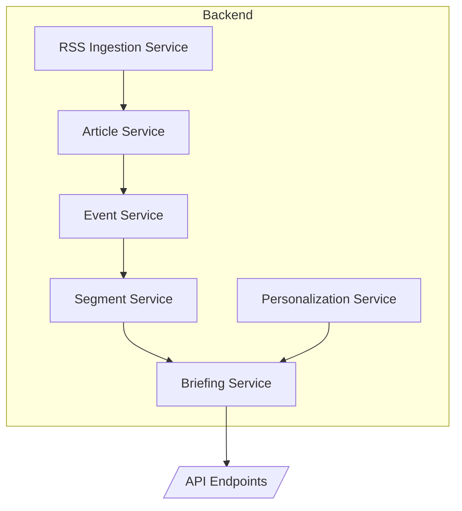
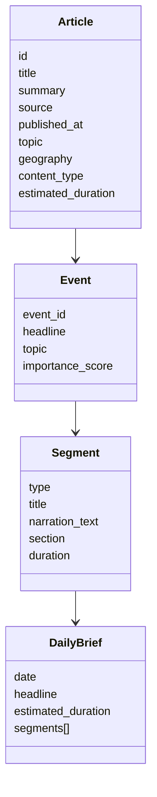
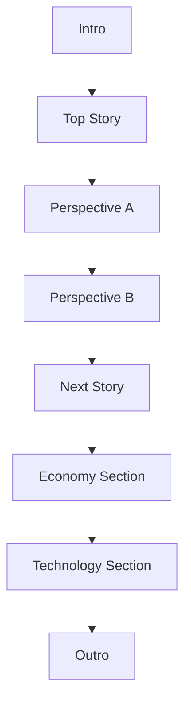
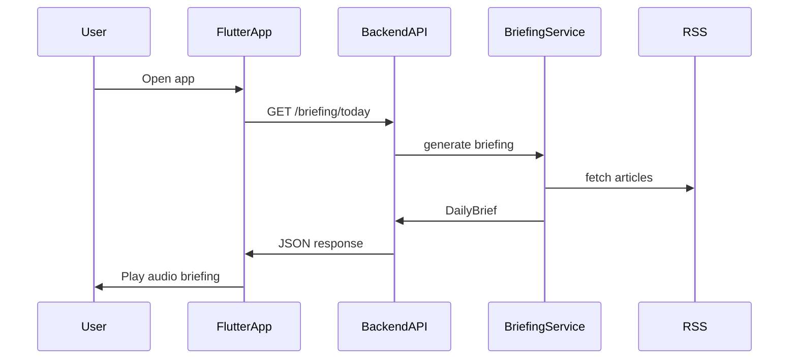

# OpenWave / Angle – System Architecture

This document describes the current technical architecture of the OpenWave system.

For conceptual architecture see:

docs/PROJECT_MAP_v2.md

---

# OpenWave – Arhitectura Backend (Next Architecture pentru MVP)

**Versiune:** 1.0
**Data:** Martie 2026
**Scop:** Definirea unei arhitecturi backend simple, clare și extensibile pentru MVP-ul OpenWave.

---

# 1. Filosofia Arhitecturii

OpenWave nu trebuie construit inițial ca o platformă AI complexă.
Pentru MVP este mult mai sănătos să existe un **pipeline clar de procesare a conținutului**, în care fiecare serviciu face un singur lucru.

Principiul de bază:

```
Surse → Articole → Evenimente → Segmente → Briefing → Redare Audio
```

Acest pipeline transformă fluxul haotic de articole de pe internet într-un **briefing audio structurat**.

Arhitectura trebuie să fie:

* modulară
* ușor de înțeles
* ușor de extins
* ușor de depanat

Pentru MVP, tot backend-ul poate rula într-un **singur serviciu FastAPI**.

---

# 2. Modelele principale de date

Pentru MVP sunt suficiente **patru modele principale**.

---

## Article

Reprezintă unitatea de bază de informație colectată din RSS.

Exemplu structură:

```
Article
│
├─ id
├─ title
├─ summary
├─ url
├─ source
├─ published_at
├─ language
├─ topic
├─ geography
├─ content_type
├─ estimated_duration
└─ section
```

Rol:

* normalizează conținutul provenit din surse diferite
* permite adăugarea de metadata

---

## Event

Un **eveniment** grupează mai multe articole despre aceeași știre.

Exemplu:

```
Event
│
├─ event_id
├─ headline
├─ topic
├─ geography
├─ importance_score
└─ articles[]
```

Avantaj:

Evită situații de genul:

```
Reuters: EU defense plan approved
BBC: Europe increases defense spending
DW: EU leaders agree new defense budget
```

Toate aceste articole devin **un singur eveniment**.

---

## Segment

Segmentul este **unitatea audio reală** din briefing.

Tipuri de segmente:

```
intro
section_cue
article
perspective
transition
outro
```

Exemplu:

```
Segment
│
├─ type: article
├─ title
├─ narration_text
├─ source_label
├─ section
└─ duration_estimate
```

Playerul consumă **segmente**, nu articole.

---

## DailyBrief

Reprezintă briefingul final trimis aplicației.

Structură:

```
DailyBrief
│
├─ date
├─ headline
├─ estimated_duration
├─ segments[]
└─ articles[]
```

DailyBrief este practic **playlist-ul audio al zilei**.

---

# 3. Serviciile backend

Arhitectura backend poate fi organizată în **6 servicii logice**.

---

## 3.1 RSS Ingestion Service

Responsabilități:

* citește feedurile RSS
* extrage articole
* normalizează datele

Diagramă:

```
RSS Feeds
   │
   ▼
RSS Ingestion Service
   │
   ▼
ArticleRaw
```

Output:

```
ArticleRaw
```

---

## 3.2 Article Processing Service

Transformă articolele brute în articole procesate.

Responsabilități:

* elimină duplicate evidente
* adaugă metadata
* estimează durata audio

Diagramă:

```
ArticleRaw
   │
   ▼
Article Processing
   │
   ▼
Article
```

Exemple de metadata:

```
topic
geography
content_type
section
estimated_duration
```

---

## 3.3 Event Clustering Service

Grupează articolele care vorbesc despre același eveniment.

Diagramă:

```
Article
   │
   ▼
Event Clustering
   │
   ▼
Event
```

Problema rezolvată:

Evită repetarea aceleiași știri în briefing.

---

## 3.4 Segment Service

Transformă articolele sau evenimentele în segmente audio.

Diagramă:

```
Event / Article
     │
     ▼
Segment Service
     │
     ▼
Segments
```

Exemple de segmente:

```
IntroSegment
ArticleSegment
PerspectiveSegment
TransitionSegment
OutroSegment
```

---

## 3.5 Briefing Service

Este **orchestratorul principal** al aplicației.

Responsabilități:

* selectează evenimentele importante
* stabilește ordinea
* creează structura briefingului
* generează playlistul final

Diagramă:

```
Segments
   │
   ▼
Briefing Service
   │
   ▼
DailyBrief
```

Structura unui briefing tipic:

```
Intro
Top Story
Next Story
Economy
Technology
International
Outro
```

Endpoint principal:

```
GET /briefing/today
```

---

## 3.6 Personalization Service

Aplică preferințele utilizatorului asupra selecției de conținut.

Exemple de preferințe:

```
topic_weights
geography_weights
content_type_weights
perspective_mix
```

Diagramă:

```
User Preferences
       │
       ▼
Personalization Service
       │
       ▼
Adjusted Article/Event Scores
```

Pentru MVP, acest serviciu poate fi simplu.

---

# 4. Fluxul complet al sistemului

Diagrama principală:

```
       RSS Feeds
           │
           ▼
   RSS Ingestion Service
           │
           ▼
   Article Processing
           │
           ▼
     Event Clustering
           │
           ▼
     Segment Service
           │
           ▼
     Briefing Service
           │
           ▼
     API /briefing/today
           │
           ▼
       Flutter Player
```

Acest pipeline produce briefingul audio.

---

# 5. Structura recomandată a backend-ului

Structura proiectului poate arăta astfel:

```
backend/app/

  api/
    routes/
      articles.py
      briefing.py

  models/
    article.py
    event.py
    segment.py
    briefing.py
    preferences.py

  services/
    rss_ingestion_service.py
    article_service.py
    event_service.py
    segment_service.py
    briefing_service.py
    personalization_service.py
```

Avantaje:

* cod organizat
* responsabilități clare
* extensibilitate bună

---

# 6. Prioritățile reale pentru MVP

Ordinea recomandată de dezvoltare:

1. îmbunătățirea metadata pentru `Article`
2. consolidarea modelului `Segment`
3. extinderea logicii `BriefingService`
4. introducerea `Event Clustering` dacă apar repetări
5. adăugarea graduală a personalizării

---

# 7. Principiul cheie al proiectului

OpenWave nu trebuie gândit ca:

```
aplicație care citește articole
```

ci ca:

```
motor care compune briefinguri audio din segmente
```

Segmentul este unitatea centrală a experienței audio.

---

# 8. Rezumat

Arhitectura OpenWave pentru MVP trebuie să rămână un pipeline simplu:

```
Articles → Events → Segments → Briefing
```

`BriefingService` orchestrează sistemul și produce sesiuni audio structurate pentru aplicația mobilă.

Această arhitectură este suficient de simplă pentru MVP și suficient de flexibilă pentru a suporta în viitor:

* Perspective Mode
* personalizare avansată
* tipuri multiple de briefing
* noi tipuri de conținut

# 10. Architecture Principles

The system follows these principles:

- modular services
- clear domain models
- incremental evolution
- API-first backend
- mobile-first user experience

Avoid premature complexity.

The system should evolve gradually from a minimal MVP toward a full audio-first news platform.
# OpenWave – System Architecture (MVP)

**Version:** 1.0
**Date:** March 2026

Acest document descrie arhitectura tehnică a sistemului **OpenWave** pentru MVP.
Scopul arhitecturii este să fie:

* simplă
* modulară
* ușor de extins
* ușor de înțeles

OpenWave transformă fluxul haotic de articole de pe internet într-un **briefing audio structurat**.

---

# 1. Principiul arhitectural

Arhitectura OpenWave este bazată pe un **pipeline de procesare a conținutului**.

Fluxul fundamental este:

```
Surse → Articole → Evenimente → Segmente → Briefing → Player
```

Această transformare este esența produsului.

---

# 2. Pipeline-ul principal al sistemului


Explicație:

1. Sistemul colectează articole din feeduri RSS.
2. Articolele sunt procesate și îmbogățite cu metadata.
3. Articolele similare sunt grupate în evenimente.
4. Evenimentele sunt transformate în segmente audio.
5. Segmentele sunt organizate într-un briefing.
6. Briefingul este livrat aplicației mobile.

---

# 3. Serviciile backend

Backend-ul OpenWave este organizat în servicii logice.



Rolul serviciilor:

### RSS Ingestion Service

Responsabil pentru colectarea feedurilor RSS.

Funcții:

* citește RSS
* parsează articole
* normalizează câmpurile de bază

---

### Article Service

Procesează articolele brute.

Funcții:

* elimină duplicate
* adaugă metadata
* clasifică articolele

Metadata exemple:

```
topic
geography
content_type
section
estimated_duration
```

---

### Event Service

Grupează articolele care descriu același eveniment.

Exemplu:

```
Reuters: EU defense plan approved
BBC: EU leaders agree defense spending increase
DW: Europe plans joint defense budget
```

Toate aceste articole devin un **singur eveniment**.

---

### Segment Service

Transformă articolele sau evenimentele în segmente audio.

Tipuri de segmente:

```
intro
section_cue
article
perspective
transition
outro
```

---

### Briefing Service

Este orchestratorul principal.

Funcții:

* selectează evenimentele importante
* stabilește ordinea
* creează structura briefingului
* generează DailyBrief

---

### Personalization Service

Aplică preferințele utilizatorului.

Exemple:

```
topic_weights
geography_weights
content_type_weights
perspective_mix
```

---

# 4. Modelele principale de date

OpenWave folosește patru modele principale.



Explicație:

### Article

Unitatea de bază de conținut colectată din RSS.

---

### Event

Grup de articole despre aceeași știre.

---

### Segment

Unitatea audio reală din briefing.

---

### DailyBrief

Playlistul final trimis aplicației mobile.

---

# 5. Structura briefingului audio

Un briefing OpenWave este compus din segmente audio.



Această structură oferă:

* ritm radio
* claritate
* navigare ușoară pentru ascultător

---

# 6. Interacțiunea aplicației cu backend-ul



Fluxul utilizatorului:

1. Utilizatorul deschide aplicația.
2. Aplicația cere briefingul zilei.
3. Backend-ul generează briefingul.
4. Aplicația redă segmentele audio.

---

# 7. Structura backend-ului în repository

Structura recomandată:

```
backend/app/

  api/
    routes/
      articles.py
      briefing.py

  models/
    article.py
    event.py
    segment.py
    briefing.py
    preferences.py

  services/
    rss_ingestion_service.py
    article_service.py
    event_service.py
    segment_service.py
    briefing_service.py
    personalization_service.py
```

Această structură menține codul:

* organizat
* modular
* ușor de extins

---

# 8. Priorități pentru MVP

Ordinea recomandată de dezvoltare:

1. îmbunătățirea metadata pentru `Article`
2. consolidarea modelului `Segment`
3. extinderea logicii `BriefingService`
4. introducerea `Event Clustering`
5. adăugarea personalizării

---

# 9. Principiul cheie al OpenWave

OpenWave nu trebuie gândit ca:

```
aplicație care citește articole
```

ci ca:

```
motor care compune briefinguri audio din segmente
```

Segmentele sunt unitatea centrală a experienței audio.

---

# 10. Rezumat

Arhitectura OpenWave pentru MVP este un pipeline modular:

```
Articles → Events → Segments → Briefing
```

BriefingService orchestrează întregul sistem și produce sesiuni audio structurate pentru aplicația mobilă.

Această arhitectură permite în viitor:

* Perspective Mode
* personalizare avansată
* tipuri multiple de briefing
* integrare de noi surse
* noi formate audio
# 11. Design Principles

Arhitectura OpenWave este ghidată de câteva principii simple care mențin sistemul clar și extensibil.

---

## 11.1 Segment-first architecture

Unitatea centrală a sistemului este **Segmentul**, nu articolul.

Articolele sunt doar surse de informație.
Experiența utilizatorului este construită din **segmente audio**.

Fluxul fundamental:

```
Article → Event → Segment → Briefing
```

Playerul redă **segmente**, nu articole.

---

## 11.2 Pipeline simplu de procesare

Sistemul urmează un pipeline clar:

```
RSS → Articles → Events → Segments → Briefing
```

Fiecare etapă are o responsabilitate clară.

Avantaje:

* cod ușor de înțeles
* debugging simplu
* extensibilitate

---

## 11.3 Servicii cu responsabilitate unică

Fiecare serviciu backend trebuie să facă **un singur lucru**.

Exemple:

* RSS Ingestion → colectează articole
* Article Service → procesează articole
* Event Service → grupează articole
* Segment Service → creează segmente
* Briefing Service → orchestrează briefingul

Acest principiu evită servicii monolitice.

---

## 11.4 Audio-first product

OpenWave este proiectat ca **audio-first product**, nu ca agregator de articole.

Experiența principală este:

```
Play briefing → Listen → Next story
```

Interfața și backend-ul trebuie să susțină acest model.

---

## 11.5 Simplitate pentru MVP

Pentru MVP:

* un singur backend FastAPI
* servicii logice, nu microservicii
* logică clară și modulară

Complexitatea trebuie introdusă **doar când este necesar**.

---

## 11.6 Transparence of sources

Pentru credibilitate, sistemul trebuie să menționeze clar sursele.

Fiecare segment poate include:

```
source
content_type
section
```

Utilizatorul trebuie să știe de unde provine informația.

---

## 11.7 Evoluție graduală

Arhitectura trebuie să permită adăugarea de funcții fără rescrierea sistemului.

Exemple de extensii viitoare:

* Perspective Mode
* Smart Commute
* Breaking News
* Advanced Personalization
* Multiple briefing formats

---

# Concluzie

Arhitectura OpenWave trebuie să rămână:

* modulară
* clară
* audio-first
* extensibilă

Principiul central al sistemului este:

```
Build audio briefings from structured segments.
```


---

# 12. Unified Source Watcher

OpenWave now includes a backend-only source watcher layer that sits before
article ingestion and future editorial pipelines.

Purpose:

- detect the newest published content from a configured source
- support both `news` and `commentary`
- prefer `RSS`
- fall back to `listing page` parsing
- fall back to `page metadata` parsing

Design rule:

```
latest_by_publication_time
```

not:

```
homepage_prominence
```

Minimal state is stored per source:

- `last_seen_url`
- `last_seen_title`
- `last_seen_published_at`
- `last_checked_at`

This layer does not perform:

- summarization
- clustering
- audio generation
- TTS orchestration

---

# 13. Article Fetch And Clean Layer

After source detection, OpenWave now includes a dedicated fetch layer that turns
an article page into clean editorial text.

Pipeline position:

```
Source Watcher -> Article Fetch -> Clean Text -> Future Editorial Pipeline
```

Responsibilities:

- download article HTML
- extract metadata such as title, author, published date, and source
- prefer JSON-LD article body extraction
- fall back to `<article>` text extraction
- fall back to heuristic paragraph/block extraction
- reject weak extractions below a minimum content threshold

This layer does not perform:

- summarization
- clustering
- editorial ranking
- briefing assembly
