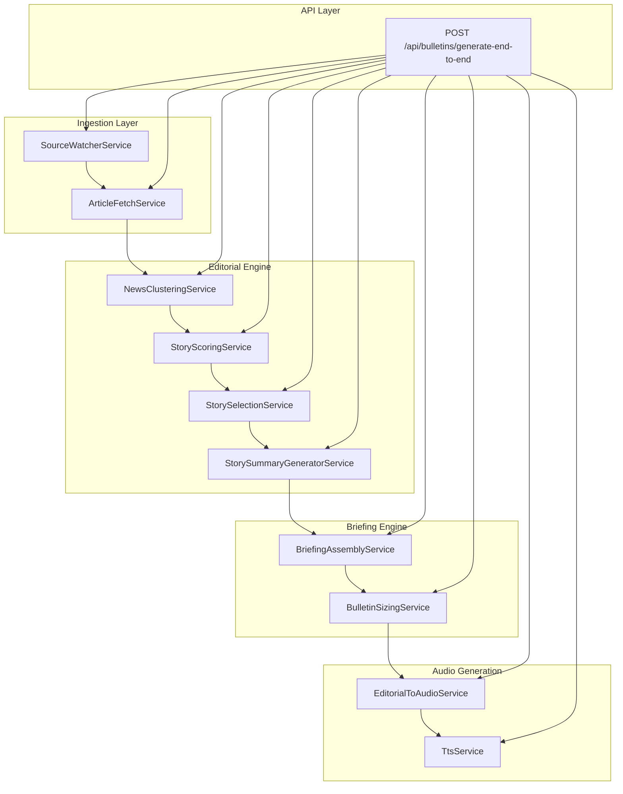

# OpenWave Architecture v1

## 1. System Overview

OpenWave is an AI-driven backend system that automatically produces Romanian radio-style news bulletins from article inputs and turns them into segmented audio.

The implemented system has two major layers:

- **Editorial pipeline**: detects or receives content, groups related reporting, scores and selects stories, generates short radio-style summaries, assembles a bulletin draft, and sizes it to a duration window.
- **Audio generation pipeline**: converts the final editorial package into ordered audio segments and feeds the existing segmented TTS pipeline.

At a high level, OpenWave is a text-to-bulletin engine followed by a bulletin-to-audio engine.

## 2. End-to-End Pipeline

The current implemented end-to-end flow is:

`SourceWatcher -> ArticleFetchService -> NewsClusteringService -> StoryScoringService -> StorySelectionService -> StorySummaryGeneratorService -> BriefingAssemblyService -> BulletinSizingService -> EditorialPipelineService -> EditorialToAudioService -> TtsService -> generated audio segments`

### Stage Summary

- **SourceWatcherService**
  Detects the newest published content from configured sources, preferring RSS and falling back to listing pages or metadata parsing.

- **ArticleFetchService**
  Downloads the target article page, extracts the main body, and returns cleaned editorial text.

- **NewsClusteringService**
  Groups clearly related articles into conservative event-level clusters.

- **StoryScoringService**
  Applies transparent editorial scoring with breakdowns.

- **StorySelectionService**
  Selects a bounded candidate set of stories using score-first logic plus modest diversity balancing.

- **StorySummaryGeneratorService**
  Produces one Romanian radio-style summary per selected story cluster.

- **BriefingAssemblyService**
  Orders story summaries into a bulletin draft, adds intro/outro, pacing behavior, presenter metadata, and optional perspective pairs.

- **BulletinSizingService**
  Checks duration against the configured target window and trims low-priority tail stories if needed.

- **EditorialPipelineService**
  Orchestrates the editorial steps into one final sized text package.

- **EditorialToAudioService**
  Maps the editorial package into ordered audio segments for intro, stories, perspectives, optional stingers, and outro.

- **TtsService**
  Reuses the existing segmented TTS generation pipeline to synthesize spoken audio files.

## 3. Backend Module Architecture

The backend is organized into subsystems rather than one monolithic generator.

### Ingestion Layer

- **SourceWatcherService**
  Watches configured news and commentary sources and identifies the latest published item by publication time, not homepage prominence.

- **ArticleFetchService**
  Converts a detected article URL into structured article metadata plus cleaned text.

### Editorial Engine

- **NewsClusteringService**
  Conservative event grouping.

- **StoryScoringService**
  Transparent scoring with explicit breakdowns.

- **StorySelectionService**
  Bounded selection with explainable accept/reject decisions.

- **StorySummaryGeneratorService**
  Generates radio-style summaries with lead typing, attribution-first phrasing, quote filtering, casualty handling, number filtering, and compliance reporting.

### Briefing Engine

- **BriefingAssemblyService**
  Builds intro/story/outro bulletin structure, handles ordering, pacing labels, lighter close logic, dual-presenter metadata, optional listener-name usage, optional pass phrases, and `Two Perspectives` insertion.

- **BulletinSizingService**
  Enforces a target duration window without rewriting stories.

### Audio Generation

- **EditorialToAudioService**
  Transforms the final briefing into ordered segment blocks, including perspectives and optional stingers.

- **TtsService**
  Synthesizes the spoken segments and stores generated audio under the existing backend audio output path.

### API Layer

- **`POST /api/bulletins/generate-end-to-end`**
  Developer-facing endpoint that runs the existing backend flow from fetched articles to final segmented audio output.

## 4. Data Model Overview

These models carry the bulletin through the system.

- **`FetchedArticle`**
  Role: cleaned article object returned by article fetch/clean logic. Includes URL, title, source, publication data, and `content_text`.

- **`StoryCluster`**
  Role: conservative grouping of multiple related articles into one event-level cluster.

- **`ScoredStoryCluster`**
  Role: wraps a `StoryCluster` with `score_total`, score components, and explanation.

- **`GeneratedStorySummary`**
  Role: one radio-style summary item with `short_headline`, `lead_type`, attribution metadata, compliance flags, quote/number/casualty/context flags, and explanation.

- **`GeneratedBriefingDraft`**
  Role: assembled text bulletin draft with intro, ordered story items, outro, estimated duration, presentation metadata, and assembly explanation.

- **`SizedBriefingDraft`**
  Role: briefing draft after duration control, with trimming actions and final duration details.

- **`FinalEditorialBriefingPackage`**
  Role: final editorial output of the text pipeline, carrying story items, intro/outro, counts, explanations, and sizing metadata.

- **`AudioGenerationPackage`**
  Role: ordered audio-ready representation of the bulletin, including intro, stories, perspectives, optional stingers, and outro.

- **`EndToEndBulletinResult`**
  Role: final orchestration result from articles to generated segment files, including execution stats and errors.

- **`Segment`**
  Role: reusable segment model used in legacy playback paths and for perspective segment reuse. Includes `TYPE_PERSPECTIVE` for editorial perspective blocks.

- **Perspective segments**
  Role: supporters/critics inserts created with the existing `Segment.TYPE_PERSPECTIVE` model and placed immediately after the triggering story.

## 5. Editorial Assembly Features

The assembly layer is where individual stories become a bulletin.

### Implemented Assembly Features

- **Strongest story opens**
  The first item is the strongest available story after ranking and flow checks.

- **Pacing labels**
  Each story gets `heavy`, `medium`, or `light`.

- **Flow adjustment**
  Score stays primary, but long runs of heavy stories are softened when good alternatives exist.

- **Lighter close when possible**
  If a lighter item exists later, assembly can move it toward the ending.

- **Intro / story / outro bulletin shape**
  Every draft is structured around a short intro, ordered story items, and a short outro.

- **Two Perspectives**
  Implemented at assembly level, not TTS level.
  Structure:

  `story -> perspective_supporters -> perspective_critics`

  Constraints:
  - maximum one perspective pair per bulletin
  - only for controversial or disputed stories
  - inserted immediately after the triggering story

- **Presenter metadata**
  Story items carry presenter voice assignment, optional pass phrase, and pacing label.

## 6. Audio Architecture

The text briefing is converted into an ordered segment package before TTS.

### Segment Types In Use

- `intro`
- `story`
- `perspective`
- `outro`
- `stinger` as an optional non-TTS audio transition block

### Conversion Path

`FinalEditorialBriefingPackage -> AudioGenerationPackage -> TtsService`

`EditorialToAudioService` keeps the segment order stable and prepares spoken segment blocks for TTS while leaving optional stingers outside synthesis.

### Audio Naming

The current segmented naming pattern follows the bulletin ID as file stem:

- `bulletinID_intro.mp3`
- `bulletinID_story_01.mp3`
- `bulletinID_story_02.mp3`
- `bulletinID_outro.mp3`

Perspective segments also follow the same stem-based segmented pattern when synthesized through the TTS block list.

## 7. Explainability

Explainability is built into multiple stages rather than added later.

- **Story scoring explanations**
  `StoryScoringService` returns explicit component breakdowns.

- **Selection explanations**
  `StorySelectionService` records why a cluster was selected or rejected.

- **Summary compliance and generation explanation**
  `StorySummaryGeneratorService` returns compliance flags, lead type, attribution mode, quote/number/casualty/context flags, and a generation explanation.

- **Assembly explanations**
  `BriefingAssemblyService` explains opener choice, pacing trace, presenter sequencing, pass count, and perspective count.

- **Sizing explanations**
  `BulletinSizingService` records whether the bulletin was kept, flagged short, or trimmed.

- **Pipeline statistics**
  `EditorialPipelineService` and `EndToEndBulletinService` expose counts such as input article count, cluster count, selected story count, final story count, and generated segment count.

## 8. Implemented vs Planned Features

### Implemented

- editorial pipeline from clustering through sizing
- conservative story summary generation
- radio lead typing
- attribution-first phrasing
- quote preservation and number filtering
- briefing assembly
- pacing labels and flow adjustment
- `Two Perspectives` insertion in assembly
- optional listener-name personalization in intro/outro
- dual-presenter metadata and pass phrases
- intro/outro variant selection
- editorial-to-audio bridge
- segmented TTS generation reuse
- optional stinger support in audio package
- end-to-end bulletin generation endpoint

### Planned / Future

- commentary pipeline integration into the modern editorial flow
- more advanced bulletin expansion when a draft is too short
- richer context/explainer mode beyond the current short context line
- more than one perspective pair per bulletin
- advanced scheduling and automation around bulletin production

### Code-Truth Note

Some features that may have been described earlier as future ideas are already implemented in the current codebase and are therefore listed above as implemented, not planned. In particular:

- dual presenter system
- intro/outro variation
- attribution variation engine
- stinger / audio cue system

## 9. Current Architectural Boundary

The architecture is stable around a text-first editorial core and a segmented audio output layer.

What the system already does well:
- turns article inputs into one coherent radio-style bulletin
- preserves explainability through major editorial decisions
- produces segmented audio through the existing TTS path

What it deliberately does not yet do:
- run a commentary editorial package end-to-end
- perform complex package optimization beyond the current conservative rules
- redesign TTS internals or Flutter playback behavior inside the editorial architecture

## 10. Personalization Contract

Personalization is now a first-class backend contract, not a UI-only or demo-only feature.

Canonical object:

- `UserPersonalization`
  - `listener_profile`
    - `first_name`
    - `country`
    - `region`
    - `city`
  - `editorial_preferences`
    - geography: `local`, `national`, `international`
    - domains: `politics`, `economy`, `sport`, `entertainment`, `education`, `health`, `tech`

Current contract path:

`API request -> EndToEndBulletinService -> EditorialPipelineService -> BriefingAssemblyService -> FinalEditorialBriefingPackage -> EndToEndBulletinResult`

Current behavior:
- personalization is always resolved explicitly
- if no payload is provided, the pipeline uses safe neutral defaults
- defaults are visible in output through `personalization_used`, `listener_profile_used`, `editorial_preferences_used`, and `personalization_defaults_applied`
- listener first-name usage in intro/outro now comes from the personalization contract, not hidden config state

Example contract fixture:
- `backend/app/config/user_personalization_example.json`
